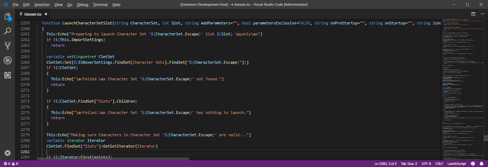

# vscode-ls1 README

This is the official [LavishScript](https://www.lavishsoft.com/wiki/index.php/LavishScript) VS Code extension from [Lavish Software](https://www.lavishsoft.com).

Currently, .iss file highlighting is supported.

## Features

* LavishScript Syntax highlighting

## Requirements

Requires [Visual Studio Code](https://code.visualstudio.com), a free and open source code editor.

For other editors, use the **syntaxes/ls1.tmLanguage.json** file

